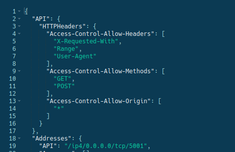
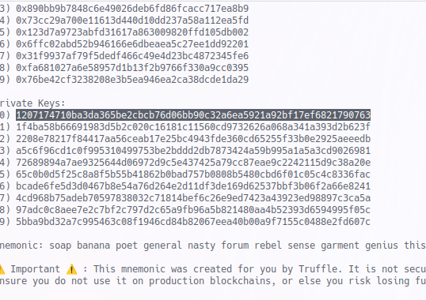

Repository for d.e.r.p., a project for the Blockchain and Distributed Ledger Technologies course 2022/2023.

### Dependencies and how to run

To run the project, you need to have the following dependencies/programs installed:
- podman (or docker)
- Elixir OTP >= 25 
- Rust compiler (needed by elixir libraries)
- Metamask
- Deno.js

After cloning the repository, open 3 terminal windows:
- the first in the root folder and run `./run-everything.sh`
- the second in `derp/derp`, and run 
    - `mix ecto.migrate`
    - `mix deps.get`
- the third one in `derp/smart_contract` and run `./run-truffle.sh`

In order to make IPFS work, you will need to access the webui on `localhost:5001/webui` anb past the Gateway HTTPHeaders section into the API, like so:

You'll then have to run the command `migrate` into the truffle prompt and `deno run --allow-net add_tokens.ts` in the main root. You should also run `mix derp.update` in `/derp` in order to update the smart contract address into the application created by phoenix. Finally, you can access the webpage on `localhost:4000` after running `mix phx.server`.

To connect to truffle, copy the reviewer private key in the third shell and insert it in metamask, after adding the truffle network at `localhost:9454`. This reviewer already has some tokens/reviews associated to them for ease of use, but feel free to use new accounts!

If you want to simulate the interaction with another website, you must also start a web server in the `shop_server` folder in order to simulate the interaction between our oracle and a third party e-store.

### Using the app

This app is more of a proof of concept rather than a complete application. As such, it is suggested to create a user in order to explore all of its features.
